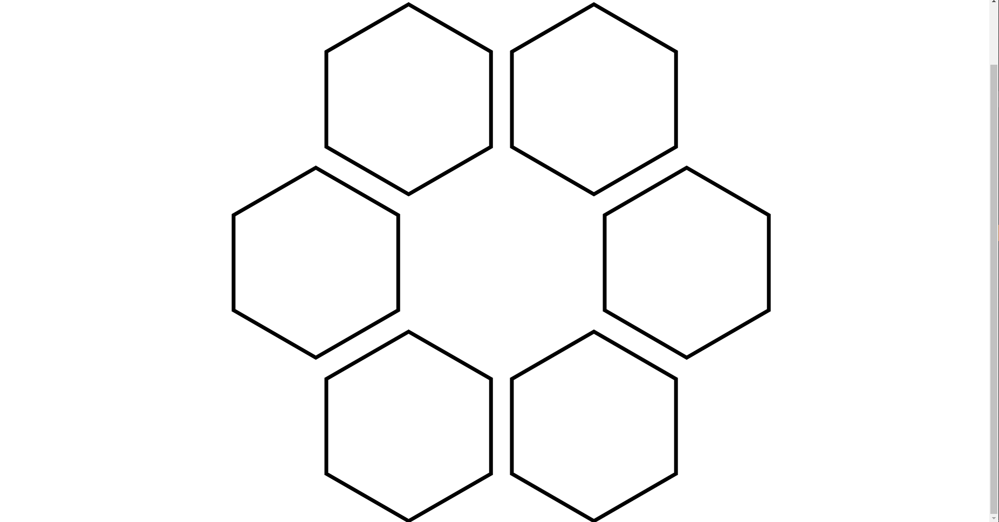
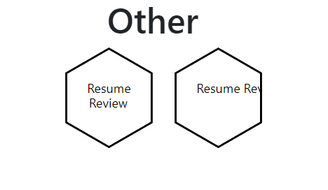

# **Hexagon Render Test**

This React Application is to test how to create, render, and style Hexagonal polygons in the extreme off-change one needs to render hexagons into their React web application.  

Credit to rexxars and rplanelles for creating the [React-Hexagon GitHub repository](https://github.com/rexxars/react-hexagon). This was really helpful in helping me figure out how to render hexagons.

## **Table of Contents**
**[Technologies Used](#technologies-used) **
**[Installation](#installation) **
**[Methods](#methods) **
**[Notes to Self](#notes-to-self) **

- [Rendering Hexagons via React Hexagon](#1-rendering-hexagons-via-react-hexagon)
- [Rendering Text in React Hexagon](#2-rendering-text-wi-hexagon-via-react-hexagon)
- [Enabling Links in Hexagons](#3-enabling-links-in-hexagons)
- [React useState Hooks](#4-react-usestate-hooks)
- [Canva](#5-canva)

**[Future Development](#future-development) **
**[Author](#author)**

## **Technologies Used**
[React.js](https://reactjs.org/) 
[React Bootstrap](https://react-bootstrap.github.io/) 
[React-Router-DOM](https://v5.reactrouter.com/web/guides/quick-start) 
[JavaScript](https://www.javascript.com/) 
[React-Helmet](https://github.com/nfl/react-helmet) 
[React-Hexagon](https://github.com/rexxars/react-hexagon) 

## **Installation**
If you want to recreate this repository for your own purposes, simply follow the following steps in your Text Editor:
1) Create a directory on your machine, open terminal, and clone the repository:

        $git clone git@github.com:jermeewinn/Hexagon-Render-Test.git

2) Navigate into project root directory:

        $cd Hexagon-Render-Test

3) Install all npm dependencies:

        $npm install

4) Initialize localhost:3000:

        $npm run start

## **Methods**
### **1) React Hexagon**
The node dependency we'll be working with will be [React Hexagon](https://github.com/rexxars/react-hexagon).

There isn't much on this other than the GitHub repository. The documentation is pretty limited, so there's going to be a lot of figuring out happening, but the demo site is promising as it is exactly what I need to get the job done.

### **2) Create Canva Account & Building the Object There**
It was recommended by members of the Slack group chat that I also create objects in Canva, a UI Design website. Visit their website [here](https://www.canva.com/search/templates?q=hexagon).

## **Notes to Self**
### **1) Rendering Hexagons via React Hexagon**
After some help from friends, I was able to render not just a single hexagon, but also a full hexagon ring. 

**Firstly**, in order to render a hexagon, you will need to set up your component to look like the following:

        import React from 'react';
        import Hexagon from 'react-hexagon';

        function Hexagon() {
                return(
                        <section>
                                

                                        <Hexagon
                                                className='hexagon-styled'
                                                style={{
                                                        stroke: 'black'
                                                }}>
                                        />
                                

                        </section>        
                );
        };

**Next** construct not 6, but 7 hexagons to create the hexagon ring. This involves creating 3 div rows with two, three, and two hexagons, respectively. With the center hexagon set to white, the final render should look like the following screenshot:

It is best if you styled not just each row, but also each individual hexagon. In the screenshot, the min-width styling is set to 250px. If you want to change the size of the hexagons while maintaining consistent spacing between each hexagon, you will need to change the width, min-width in the **.hexagon-style**, and the margin-bottom values in the **.hex-row** className values. 

Additionally, the **.hex-row** margin-bottom value is negative so that the hexagon rows can slightly overlap each other. If set to greater than/equal to 0, then the rows would align at the hexagons' points.

### **2) Rendering Text w/i Hexagon via React Hexagon**
Rendering text within a hexagon is a little tricky. In terms of a text box, the hexagon only recognizes one line at a time, and I have yet to figure out how to create a centered text element within the Hexagon. The code for the following image can be found in the **src/components/Other/index.js** file of this repository.

**Consider the hexagon on the right. ** 
Text within the Hexagon isn't rendered past the polygonal borders. I have tried using flex to center multiple lines of text, but no joy. If you have any feedback on how to do this more efficiently than the next method I'm about to show, please feel free to let me know. For reference, the code to render the right hexagon can be found here:

        <Hexagon
                className='hexagon-styled'
                style={{
                        stroke: 'black',
                }}
        >
                <text className='hex-text' x='25%' y='45%'>Resume Review</text>
        </Hexagon>

Notice that we are now inputing text into the Hexagon, so the Hexagon object won't be self-closing as shown earlier in this README.

**Consider the hexagon on the left. ** 
Centering multiple lines of text within the hexagon is going to involve a lot of trial and error. You will need to position each individual word within the hexagon based on an X/Y-axis. Positioning is based on the beginning of the word. Different sized words are going to require different X- and Y-values, so take your time to figure out what works for you. The code to render the hexagon on the left can be found here:

        <Hexagon
                className='hexagon-styled'
                style={{
                        stroke: 'black',
                }}
        >
                <text className='hex-text' x='25%' y='45%'>Resume</text>
                <text className='hex-text' x='27%' y='60%'>Review</text>
        </Hexagon>

If you were to check out the code in **src/components/Home/index.js**, you will see the variance in X- and Y-values with different sized words for each hexagon. 

**IMPORTANT NOTE:** Don't forget to style the hexagon text, otherwise the text within the hexagons would appear microscopic.

### **3) Enabling Links in Hexagons**
According to the code provided in the React Hexagon GitHub repository, inserting links into your hexagons are as simple as including an *href* property within the object tag as showin in the following code:

        <Hexagon
                className='hexagon-styled'
                style={{
                        stroke: 'black',
                }}
                href='/other'
        >
                <text className='hex-text' x='35%' y='45%'>View</text>
                <text className='hex-text' x='42%' y='60%'>All</text>
        </Hexagon>

This will enable the hexagon to link to any website or part of a website with a valid http address. In this instance, I've linked it to the "Other" page of the application, so that it will navigate to said page. This can be done with both internal & external links. 

Something to note, however, is that the clickable area of which a user can engage the href link is only limited to the the visible border of the shape, not the entire shape as a whole. In order to remedy this, be sure to add an extra "fill" value within the style array. In the React Hexagon demo, it's set to a background photo, but you can set it to a color or hex key value of need be. This will greatly increase the clickable area to engage the href link. The only issue now is that it won't engage when clicking on the text.

Final code should look like this:

        <Hexagon
                className='hexagon-styled'
                style={{
                        stroke: 'black',
                        fill: 'white'
                }}
                href='/other'
                target='_blank'
        >
                <text className='hex-text' x='35%' y='45%' href='/other'>View</text>
                <text className='hex-text' x='42%' y='60%' href='/other'>All</text>
        </Hexagon>

Of course, you can edit your target attributes to whatever you want, as you would through HTML5. More information on this can be found [here](https://www.w3schools.com/tags/att_a_target.asp).

### **4) React useState Hooks**
Integrating React useState Hooks is a bit of process. First things first, you will need to define what data is being presented, and create the template that of the state that will change. In our case, it would be the everything under HexText as seen through the code below:

        import React from 'react';

        // Define what data you want to present, and how to present it.
        function HexText({ name, description }) {
                return(
                        <>
                                <h3>{name}</h3>
                                
{description}

                        </>
                )
        };

        export default HexText;

Next is create an array of all the names and descriptions of the services rendered by the company. In order to identify them, I've added an ID tag so that they can easily be called on. This can be found in **src/components/HexRing/index.js.**

Here, we'll be using React's [useState Hook](https://reactjs.org/docs/hooks-state.html) to define the state and how the state will change. Since we are changing the state of two different objects, you will need to define the useState for both objects (name & description).

The first step is to define the state, or the page's default configuration.

        const [currentName, setCurrentName] = useState('Our Services');
        const [currentDescription, setCurrentDescription] = useState('Here are some of the services we  provide to our clients.');

This would go at the top of the React component function, and upon loading of the web page, this is what should show as default.

After the array, you would need to define the function that changes the state upon clicking a hexagon so that the name and description correspond to their respective Hexagon clicked. 

        function changeText(id) {
                // This function will need an input parameter that pulls the ID.
                setCurrentName(services[id].name);
                setCurrentDescription(services[id].description);
        };

Finally, we need to implement an onClick handler that changes the text in the textbox to the object with its corresponding ID, since we've tagged function changeText with "id" in the parenthesis. An example is shown here:

        <Hexagon
                className='hexagon-styled'
                onClick={() => changeText(1)}
                style={{
                        stroke: 'black',
                        fill: 'white'
                }}
        >
                <text className='hex-text' x='25%' y='45%'>Resume</text>
                <text className='hex-text' x='27%' y='60%'>Review</text>
        </Hexagon>

**onClick={() => changeText(1)}** will return the name and description as defined in the array under ID 1 as shown in your defined text component(HexText).

**IMPORTANT:** The best way to think about this is to talk to yourself in plain English what you're trying to do. If you're using a verb, you're likely going to need to create a function. If you're using a noun, you're going to need to create a constant or a variable. Start with what you need to do, and then broadstrokes back to the specifics.

### **5) Canva**
Canva could be a good alternative to work with *if* you pay for their pro subscription. Otherwise, their free options are pretty limited, especially working with Hexagons. This would be useful if one were more concentrated on creating UX/UI elements, and if you had money to go with it.

## **Future Development**
- ~~Figure out a way to add pictures, text, clickable text, etc. to individual Hexagons.~~
- ~~Figure out a way to enable href links through the hexagon. The source code from the demo doesn't seem to be working.~~
- ~~Figure out a way to enable href links throughout the whole hexagon. As of right now, href links can only be engaged when clicking on the visible borders of the polygon.~~ 
- ~~Figure out a way to enable clicking of a hexagon to correlate to a text shown in the next object. (This will be done via useState Hooks)~~
- ~~Figure out a way to show correlating titles to text sections w/ useState Hooks and onClick event handlers.~~

## **Author**
This application was created by Jeremy Huynh. If you have any inquries, my socials can be found below:
- **[LinkedIn Profile](https://www.linkedin.com/in/jeremy-huynh/)**
- **[GitHub Repository](https://github.com/jermeewinn)**